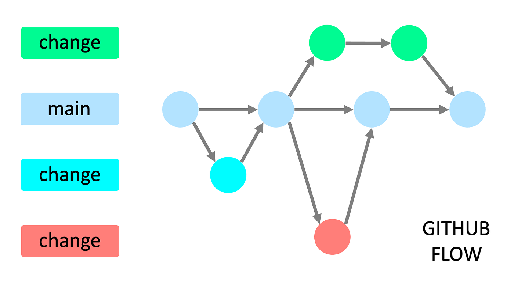

# Contributing Guidelines

Welcome to our development project for WoPeD! To ensure a smooth and efficient workflow for everyone involved, we follow a structured development process. Please adhere to the following guidelines when contributing.

## Fork the Repository

please begin by forking the repository to your own GitHub account.

You can follow GitHub's official guide here:  
👉 [How to fork a repository](https://docs.github.com/en/get-started/quickstart/fork-a-repo)

Once forked, clone your forked repository locally and work from there.

## Create a new Branch 

Before starting any development work, create a new feature branch from the `main` branch.  
🚫 **Do not develop directly on the `main` branch.**

Branch names should follow this pattern:

``` 
feature/<short-description>
```

**Examples:**
- `feature/login-page`
- `feature/database-schema` 

## Commit to the Branch

### Commit Naming Convention

All commits should follow the [conventional commits](https://www.conventionalcommits.org/en/v1.0.0/) specification to maintain clarity and traceability:

```
<type>(optional scope): <description>

[optional body]
```

**Examples:**
```
fix(api): prevent racing of requests

Introduce a request id and a reference to latest request. Dismiss
incoming responses other than from latest request.
```
```
feat(api)!: send an email to the customer when a product is shipped
```

**Use the following <types>:**
- `feat` – new feature  
- `fix` – bug fix
- `build` – build system modifications
- `chore` – maintenance tasks
- `ci` – CI config changes
- `docs` – documentation changes
- `style` – code style/formatting
- `refactor` – changes due to refactoring
- `revert` – revert changes
- `perf` – performance optimizations
- `test` – tests

A scope may be provided to a commit’s type, to provide additional contextual information and is contained within parenthesis.
Please mark **breaking changes** with an `!` after the type/scope. 

### Commit Hooks

To enforce consistency and code quality, we use Git hooks.

**Hooks in use:**
- `pre-commit`: Formats the code before allowing a commit.  
- `commit-msg`: Verifies that the commit message adheres to our naming convention.
- `post-checkout`: Informs about branch names that violate our branching strategy.

## Create a Pull Request

Once your changes are complete and pushed to your feature branch:

1. Open a Pull Request (PR) against the `main` branch of the original repository.
2. Ensure your PR fulfills all the requirements listed in the PR Template
3. Reviewers will check your code for correctness, style, and completeness.
4. Once approved, your PR can be merged.
