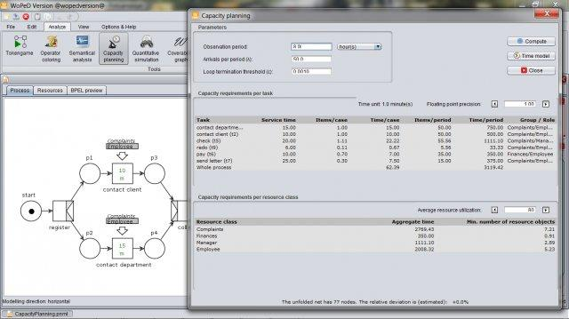

<a name="readme-top"></a>

<div align="center">
  <a href="https://github.com/woped/WoPeD/graphs/contributors">
    
  </a>
  <a href="https://github.com/woped/WoPeD/network/members">
    
  </a>
  <a href="https://github.com/woped/WoPeD/stargazers">
    
  </a>
  <a href="https://github.com/woped/WoPeD/issues">
    
  </a>
  <a href="https://github.com/woped/WoPeD/blob/main/LICENSE">
    
  </a>
  
  <!-- PROJECT LOGO -->
  <br />
  <br />
  <a href="https://github.com/woped/WoPeD">
    
  </a>

  <h3 align="center">WoPeD<br/>(Workflow Petri Net Designer)</h3>
  
  <p align="center">
    An easy-to-use software for modelling, simulating and analyzing processes described by workflow nets, a Petri net class initially introduced by Wil van der Aalst (TU Eindhoven).
    <br />
    <a href="https://woped.dhbw-karlsruhe.de/"><strong>Go to woped.dhbw-karlsruhe.de »</strong></a>
    <br />
    <br />
    <a href="https://github.com/woped/WoPeD/issues">Report Bug</a>
    ·
    <a href="https://github.com/woped/WoPeD/issues">Request Feature</a>
	·
    <a href="mailto:thomas.freytag@dhbw-karlsruhe.de">Contact me</a>
  </p>
</div>


## Table of Contents
<!-- TABLE OF CONTENTS -->
<ol>
  <li><a href="#table-of-contents">Table of Contents</a></li>
  <li>
    <a href="#about-the-project">About The Project</a>
    <ul>
      <li><a href="#built-with">Built With</a></li>
      <li><a href="#screenshots">Screenshots</a></li>
    </ul>
  </li>
  <li>
    <a href="#getting-started">Getting Started</a>
    <ul>
      <li><a href="#prerequisites">Prerequisites</a></li>
      <li><a href="#installation">Installation</a></li>
    </ul>
  </li>
  <li>
	<a href="#contributing">Contributing</a>
	<ul>
      <li><a href="#configuration-for-development">Configuration for development</a></li>
    </ul>
  </li>
  <li><a href="#license">License</a></li>
</ol>


<!-- ABOUT THE PROJECT -->
## About The Project

The main goal is to provide an easy-to-use software for modelling, simulating and analyzing processes described by workflow nets, a Petri net class initially introduced by Wil van der Aalst (TU Eindhoven). WoPeD is a good choice for researchers, teaching staff or students dealing with the application of Petri nets to the area of workflow or business process management. WoPeD has already been successfully used in numerous lectures and student assessment projects all over the world.

<p align="right">(<a href="#readme-top">back to top</a>)</p>


### Built With

* [![Java][Java]][Java-url]
* [![HTML][Html]][Html-url]
* [![CSS][Css]][Css-url]


<p align="right">(<a href="#readme-top">back to top</a>)</p>

### Screenshots

</img>
</img>
</img>
</img>
</img>
</img>


<!-- GETTING STARTED -->
## Getting Started

WoPeD is a Java program and should run on every platform supported by Java. It has been verified that WoPeD runs on the most common platforms Windows, MacOS and Linux. User-friendly installer packages for these three platforms are provided.

### Prerequisites

The Java Runtime Enviroment in Version 11 is a prerequisite.

You can download the JRE from [openlogic.com](https://www.openlogic.com/openjdk-downloads) for your System.

On Windows, you need to setup the `JAVA_HOME` environment variables, by running:
   ```sh
   setx JAVA_HOME "C:\Program Files\OpenLogic\jre-11.0.24.8-hotspot"
   ```


### Installation

1. Download the currenty Version from [GitHub](https://github.com/woped/WoPeD/releases) or [woped.dhbw-karlsruhe.de](https://woped.dhbw-karlsruhe.de/?page_id=22)
2. Run the installer

You can find more information at [woped.dhbw-karlsruhe.de](https://woped.dhbw-karlsruhe.de/?page_id=273)

<p align="right">(<a href="#readme-top">back to top</a>)</p>


<!-- CONTRIBUTING -->
## Contributing

If you have a suggestion that would make this better, please fork the repo and create a pull request. You can also simply open an issue with the tag "enhancement".
Don't forget to give the project a star! Thanks again!

1. Fork the Project
2. Create your Feature Branch (`git checkout -b feature/AmazingFeature`)
3. Commit your Changes (`git commit -m 'Add some AmazingFeature'`)
4. Push to the Branch (`git push origin feature/AmazingFeature`)
5. Open a Pull Request

### Configuration for development
In order to develop on your local machine, `mvn install` is required in a first step. 
Since some of our dependencies are available via `GitHub Packages`, the following steps are required before you can run `mvn install`. 
1. Create personal access token [Account -> Developer Settings -> Personal access token]
2. Create file `~/.m2/settings.xml`
3. Copy content of [GitHub Guide](https://docs.github.com/en/packages/working-with-a-github-packages-registry/working-with-the-apache-maven-registry) into the xml file of step 2 and replace the username and token with your data.

After running `mvn install`, it's essential to [set up git hooks](https://github.com/woped/woped-git-hooks/blob/main/README.md#activating-git-hooks-after-cloning-a-repository) to ensure project standards.

<p align="right">(<a href="#readme-top">back to top</a>)</p>


<!-- LICENSE -->
## License

Distributed under the LGPL-3.0 license License. See `LICENSE` for more information.

<p align="right">(<a href="#readme-top">back to top</a>)</p>


<!-- MARKDOWN LINKS & IMAGES -->
<!-- https://www.markdownguide.org/basic-syntax/#reference-style-links -->
[Java]: https://img.shields.io/badge/Java-ED8B00?style=for-the-badge&logo=openjdk&logoColor=white
[Java-url]: https://dev.java/

[Html]: https://img.shields.io/badge/HTML-239120?style=for-the-badge&logo=html5&logoColor=white
[Html-url]: https://wiki.selfhtml.org/wiki/HTML

[Css]: https://img.shields.io/badge/CSS-239120?&style=for-the-badge&logo=css3&logoColor=white
[Css-url]: https://wiki.selfhtml.org/wiki/CSS
